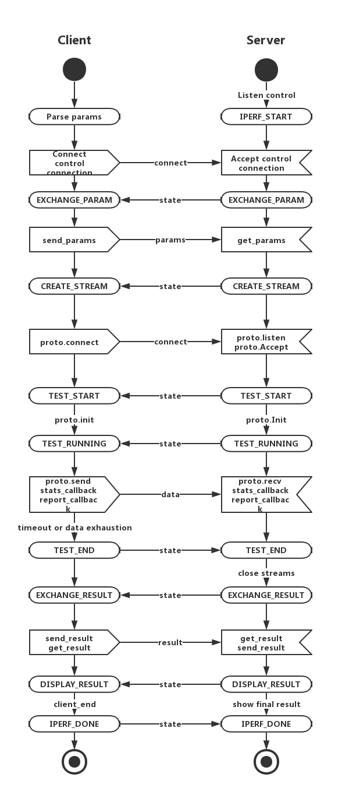

# iperf-go

由于现有的较为完备的网络测试工具如 NS2 (Network Simulator) 学习成本较高，而且对于非 c/c++ 写的网络协议支持性不好。 而轻量级网络测试级工具例如 iperf3，本身架构上对支持协议的横向扩展考虑得不够到位，现在最新版也只能支持 TCP，UDP，STCP 三种协议，然而实际上应用层有上百种协议，并且部分开发者有测试自定义协议的需求。 所以 iperf-go 就是这样一个工具，**通过实现极为简单的接口，就能够对自定义协议进行网络测速**。

实现参考了iperf3的C的源码，用Go语言实现。

## 使用方法

### TCP 测速

在服务器上

    ./iperf-go -s
    
在默认参数下，在客户端启动对TCP测速

    ./iperf-go -c <server_ip_addr>

更加详细的参数参考 `./iperf-go -h`
### ./iperf-go -h
    Usage of ./iperf-go:
      -D	no delay option
      -P uint
            The number of simultaneous connections (default 1)
      -b uint
            bandwidth limit. (Mb/s)
      -c string
            client side (default "127.0.0.1")
      -d uint
            duration (s) (default 10)
      -debug
            debug mode
      -f uint
            flush interval for rudp (ms) (default 10)
      -h	this help
      -i uint
            test interval (ms) (default 1000)
      -l uint
            send/read block size (default 1400)
      -nc
            no congestion control or BBR (default true)
      -p uint
            connect/listen port (default 5201)
      -proto string
            protocol under test (default "tcp")
      -rb uint
            read buffer size (Kb) (default 4096)
      -s	server side
      -w uint
            rudp window size (default 32)
      -wb uint
            write buffer size (Kb) (default 4096)

### 自定义协议测速

针对自己写的应用层协议，只需要实现几个简单的接口即可测速。

    type protocol interface {        
        //name string        
        name()  string        
        accept(test *iperf_test) (net.Conn, error)        
        listen(test *iperf_test) (net.Listener, error)        
        connect(test *iperf_test) (net.Conn, error)        
        send(test *iperf_stream) int        
        recv(test *iperf_stream) int        
        // init will be called before send/recv data
        init(test *iperf_test) int        
        // stats_callback will be invoked intervally, please get some other statistics in this function
        stats_callback(test *iperf_test, sp *iperf_stream, temp_result *iperf_interval_results) int
    }
    
实现了这个接口之后，可获得最基本的带宽数据，对于 RTT，丢包或者其他自定义的统计变量，需要在 `stats_callback` 中从协议中获取

具体实现可参考已实现的 `iperf_rudp.go`

# 结果展示

    Server listening on 5201
    Accept connection from client: 221.4.34.225:8344
    [ ID]    Interval        Transfer        Bandwidth        RTT
    [  0] 0.00-1.00 sec	 0.61 MB	 4.87 Mb/s	 164.4ms
    [  0] 1.00-2.00 sec	 2.32 MB	18.57 Mb/s	 164.4ms
    [  0] 2.00-3.00 sec	 0.95 MB	 7.59 Mb/s	 164.4ms
    [  0] 3.00-4.00 sec	 2.20 MB	17.64 Mb/s	 164.4ms
    [  0] 4.00-5.00 sec	 3.44 MB	27.53 Mb/s	 164.4ms
    [  0] 5.00-6.00 sec	 2.39 MB	19.16 Mb/s	 164.4ms
    [  0] 6.00-7.00 sec	 0.01 MB	 0.04 Mb/s	 164.4ms
    [  0] 7.00-8.00 sec	 1.75 MB	14.01 Mb/s	 164.4ms
    [  0] 8.00-9.00 sec	 0.12 MB	 0.94 Mb/s	 164.4ms
    [  0] 9.00-10.33 sec	 0.24 MB	 1.94 Mb/s	 164.4ms
    - - - - - - - - - - - - SUMMARY - - - - - - - - - - - -
    [ ID]    Interval        Transfer        Bandwidth        RTT
    [  0] 0.00-10.33 sec	14.04 MB	11.23 Mb/s	 164.4ms

## 内部状态机

#  
